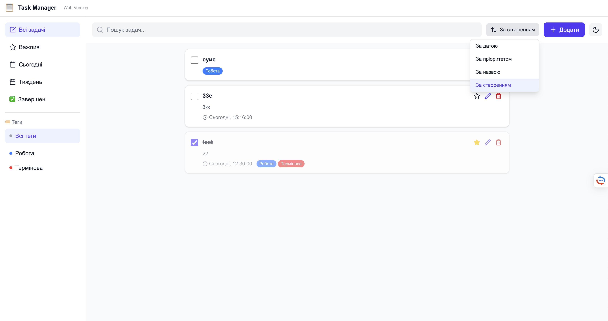
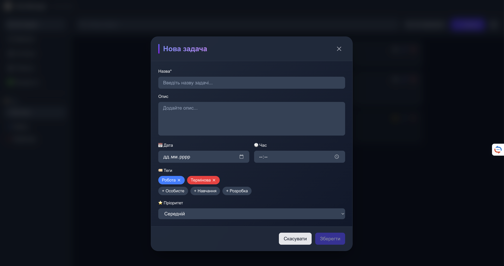
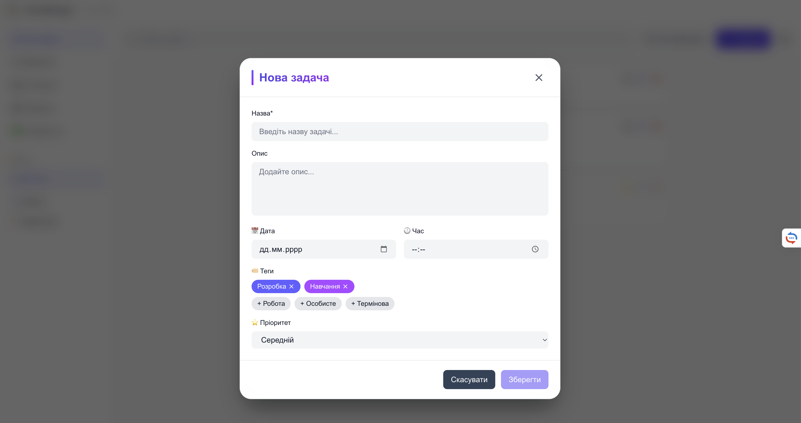

# 📋 Task Manager - Desktop Application

Повнофункціональний менеджер задач з веб і десктопною версією. Створено з використанням Next.js, NestJS та Electron.


---

## 📸 Скріншоти

### Головний екран (Dark Mode)


### Головний екран (Light Mode)



### Створення задачі



### Сортування та фільтри



---

## 🚀 Технології

-   **Frontend**: Next.js 16, React 19, TailwindCSS 4
-   **Backend**: NestJS, TypeORM, PostgreSQL
-   **Desktop**: Electron 39
-   **State Management**: TanStack Query (React Query)

---

## 📦 Встановлення

### Системні вимоги

-   Node.js
-   npm
-   PostgreSQL

### 1. Клонування репозиторію

```bash
git clone
cd task-manager
```

### 2. Встановлення залежностей

Встановіть залежності для всіх частин проекту:

```bash
# Backend (NestJS)
cd backend
npm install

# Frontend (Next.js)
cd ../app
npm install

# Electron
cd ../src-electron
npm install
```

---

## ⚙️ Налаштування

### База даних (PostgreSQL)

1. Створіть базу даних:

```sql
CREATE DATABASE task_manager;
```

2. Створіть файл `.env` в папці `backend`:

```bash
cd backend
touch .env
```

### Приклад `.env` (Backend)

```env
# Database
DB_HOST=localhost
DB_PORT=5432
DB_USERNAME=postgres
DB_PASSWORD=your_password
DB_DATABASE=task_manager

# Server
PORT=3001
NODE_ENV=development

# CORS
CORS_ORIGIN=http://localhost:3000,http://localhost:3002
```

### Приклад `.env.local`(Fontend)

```env
# API Base URL
NEXT_PUBLIC_API_URL=http://localhost:3001
```

---

## 🏃 Запуск проекту

### Варіант 1: Запуск всього одночасно (Рекомендовано)

З папки `src-electron`:

```bash
cd src-electron
npm run dev
```

Це автоматично запустить:

1. 🟢 Backend (NestJS) на `http://localhost:3001`
2. 🔵 Frontend (Next.js) на `http://localhost:3000`
3. ⚡ Electron desktop app

**Консоль покаже:**

```
[server]  🚀 Server is running on http://localhost:3001
[client]  ✓ Ready on http://localhost:3000
[electron] 🚀 Starting Electron app...
```

---

### Варіант 2: Запуск окремо (для розробки)

#### 1. Запуск Backend (NestJS)

```bash
cd backend
npm run start:dev
```

Backend буде доступний на: `http://localhost:3001`

**Доступні команди:**

-   `npm run start` - production режим
-   `npm run start:dev` - development з hot-reload
-   `npm run start:debug` - з дебагером
-   `npm run build` - збілдити для production

#### 2. Запуск Frontend (Next.js)

```bash
cd app
npm run dev
```

Frontend буде доступний на: `http://localhost:3000`

**Доступні команди:**

-   `npm run dev` - development сервер
-   `npm run build` - збілдити для production
-   `npm run start` - запустити production білд
-   `npm run lint` - перевірити код
-   `npm run format` - форматувати код

#### 3. Запуск Electron (якщо Backend і Frontend вже працюють)

```bash
cd src-electron
npm run dev:electron-only
```

Це запустить тільки Electron вікно, яке підключиться до вже запущених Backend і Frontend.

---

## 📱 Використання

### Веб-версія

Відкрийте браузер: `http://localhost:3000`

**Features:**

-   ✅ Створення, редагування, видалення задач
-   ✅ Фільтри (Всі, Зірочка, Сьогодні, Тиждень, Виконані)
-   ✅ Пошук задач
-   ✅ Теги і пріоритети
-   ✅ Темна/світла тема
-   ✅ Сортування задач

### Desktop версія (Electron)

Запустіть через `npm run dev` або `npm run dev:electron-only`

**Додаткові features:**

-   ✅ Нативне вікно з кастомними кнопками
-   ✅ Перетягування вікна за header
-   ✅ Кнопки мінімізації, максимізації, закриття
-   ✅ Offline робота (локальний сервер)

---

## 🛠️ Збірка для production

### Збірка Desktop застосунку

#### macOS

```bash
cd src-electron
npm run package:mac
```

Результат: `src-electron/release/Task Manager-1.0.0.dmg`

**Формати:**

-   `.dmg` - інсталятор для macOS
-   `.zip` - portable версія

#### Windows

```bash
cd src-electron
npm run package:win
```

Результат: `src-electron/release/Task Manager Setup 1.0.0.exe`

**Формати:**

-   `nsis` - інсталятор для Windows
-   `portable` - portable версія

#### Linux

```bash
cd src-electron
npm run package:linux
```

Результат: `src-electron/release/Task Manager-1.0.0.AppImage`

**Формати:**

-   `AppImage` - universal Linux app
-   `.deb` - для Debian/Ubuntu

#### Всі платформи

```bash
cd src-electron
npm run package
```

---

<!-- ## 📂 Структура проекту

```
task-manager/
├── app/                    # Next.js Frontend
│   ├── app/               # App Router
│   │   ├── page.tsx      # Головна сторінка
│   │   ├── layout.tsx    # Layout
│   │   └── globals.css   # Глобальні стилі
│   ├── src/
│   │   ├── components/   # React компоненти
│   │   │   ├── features/ # Sidebar, TaskList, TaskModal
│   │   │   └── ui/       # Button, SortDropdown
│   │   ├── lib/
│   │   │   ├── hooks/    # useTasks (React Query)
│   │   │   ├── types/    # TypeScript типи
│   │   │   └── utils/    # Утиліти (sortTasks)
│   │   └── types/
│   │       └── electron.d.ts  # Electron типи
│   └── package.json
│
├── backend/               # NestJS Backend
│   ├── src/
│   │   ├── tasks/        # Tasks module
│   │   │   ├── dto/      # Data Transfer Objects
│   │   │   ├── entities/ # TypeORM entities
│   │   │   ├── tasks.controller.ts
│   │   │   ├── tasks.service.ts
│   │   │   └── tasks.module.ts
│   │   ├── app.module.ts
│   │   └── main.ts
│   └── package.json
│
├── src-electron/          # Electron Desktop
│   ├── main.ts           # Головний процес
│   ├── preload.ts        # Preload скрипт
│   ├── server.ts         # NestJS інтеграція (не використовується)
│   ├── package.json
│   └── tsconfig.json
│
└── README.md             # Цей файл
```

--- -->

## 🎨 Features

### ✅ Управління задачами

-   Створення нових задач
-   Редагування існуючих
-   Видалення задач
-   Відмітка як виконане
-   Додавання до обраного (зірочка)

### 🏷️ Організація

-   Теги для категоризації
-   Пріоритети (low, medium, high)
-   Дата і час
-   Кількість вкладень
-   Опис задачі

### 🔍 Фільтри і пошук

-   Всі задачі
-   Зірочка (обрані)
-   Сьогодні
-   Цього тижня
-   Виконані
-   За тегами
-   Текстовий пошук

### 🎯 Сортування

-   За датою створення
-   За датою виконання
-   За пріоритетом
-   За назвою (A-Z)

### 🌓 Теми

-   Темна тема (за замовчуванням)
-   Світла тема

---

## 🔧 API Endpoints

### Tasks

| Method | Endpoint     | Опис                  |
| ------ | ------------ | --------------------- |
| GET    | `/tasks`     | Отримати всі задачі   |
| GET    | `/tasks/:id` | Отримати задачу за ID |
| POST   | `/tasks`     | Створити нову задачу  |
| PATCH  | `/tasks/:id` | Оновити задачу        |
| DELETE | `/tasks/:id` | Видалити задачу       |

### Приклад запиту (POST /tasks)

```json
{
    "title": "Завершити проект",
    "description": "Фінальні правки та тестування",
    "completed": false,
    "starred": true,
    "date": "2025-11-20",
    "time": "14:00",
    "tags": ["робота", "термінове"],
    "priority": "high",
    "attachments": 2
}
```

**Дякуємо за використання Task Manager! 🎉**
